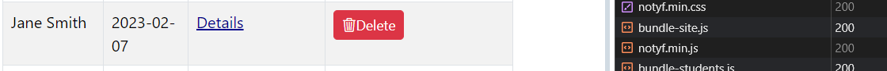
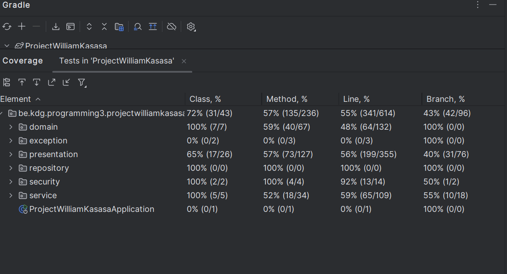

# Taekwondo Project - Programming 5

## Student Information
- Name: William Kasasa
- KdG Email: william.kasasa@student.kdg.be
- Student ID: 0162810-44
- Academic Year: 2023-2024
- Group: ACS202

## Description
This project is a Taekwondo management system developed using Java with Spring Boot, Hibernate, and PostgreSQL. It allows for the management of instructors, students, techniques, and their relationships.

## Domain Entities
### Instructor
- Represents a Taekwondo instructor.
- Attributes:
    - id: unique identifier
    - title: title of the instructor
    - name: name of the instructor
- Relationships:
    - One-to-Many with Student: an instructor can have multiple students
  

### Student
- Represents a Taekwondo student.
- Attributes:
    - id: unique identifier
    - name: name of the student
    - start: start date of the student's training
- Relationships:
    - Many-to-One with Instructor: a student belongs to one instructor
    - One-to-Many with StudentTechnique: a student can have multiple techniques

### Technique
- Represents a Taekwondo technique.
- Attributes:
    - id: unique identifier
    - name: name of the technique
    - type: type of the technique (enum)
    - description: description of the technique
- Relationships:
    - One-to-Many with StudentTechnique: a technique can be practiced by multiple students

### StudentTechnique
- Represents the proficiency level of a student in a technique.
- Attributes:
    - id: unique identifier
    - student: reference to the student
    - technique: reference to the technique
    - level: proficiency level (enum)

## Build and Run Instructions
1. Ensure Docker is running on your system.
2. Clone this repository.
3. Navigate to the project directory.
4. Run `docker-compose up` to start the PostgreSQL database.
5. Open the project in your IDE.
6. Configure the following properties in `src/main/resources/application.properties`:
   spring.datasource.url=jdbc:postgresql://localhost:5600/taekwondo
   spring.datasource.username=admin
   spring.datasource.password=admin

arduino

7. Build and run the project using Gradle:
   ./gradlew build
   ./gradlew bootRun


8. Access the application at `http://localhost:8082`.

## Dependencies
- Spring Boot
- Spring Data JPA
- Spring Web
- Thymeleaf
- PostgreSQL
- Bootstrap
- WebJars
- Jackson
- 
- Hibernate
- Jakarta Persistence
- Java 17


Certainly! Here's the complete README.md file for Week 2 of the Taekwondo Student Technique System:

```markdown
# Taekwondo Student Technique System - Week 2

## HTTP Requests and Responses

### Retrieving All Students
#### Action: GET all students
#### Request:
```http
GET http://localhost:8082/api/students
Content-Type: application/json
```

#### Response: 200 OK
```http
GET http://localhost:8082/api/students

HTTP/1.1 200 
Vary: Origin
Vary: Access-Control-Request-Method
Vary: Access-Control-Request-Headers
X-Content-Type-Options: nosniff
X-XSS-Protection: 0
Cache-Control: no-cache, no-store, max-age=0, must-revalidate
Pragma: no-cache
Expires: 0
X-Frame-Options: DENY
Content-Type: application/json
Transfer-Encoding: chunked
Date: Sun, 26 May 2024 11:29:27 GMT

[
  {
    "id": 1,
    "name": "John Doe",
    "startDate": "2023-01-01"
  },
  {
    "id": 2,
    "name": "Jane Smith",
    "startDate": "2023-02-15"
  },
  {
    "id": 3,
    "name": "Bob Johnson",
    "startDate": "2023-03-20"
  },
  {
    "id": 4,
    "name": "Alice Williams",
    "startDate": "2023-04-25"
  },
  {
    "id": 5,
    "name": "Charlie Brown",
    "startDate": "2023-05-30"
  },
  {
    "id": 6,
    "name": "Daisy Miller",
    "startDate": "2023-06-30"
  },
  {
    "id": 7,
    "name": "Eddie Murphy",
    "startDate": "2023-07-30"
  },
  {
    "id": 8,
    "name": "Fiona Apple",
    "startDate": "2023-08-30"
  },
  {
    "id": 9,
    "name": "George Washington",
    "startDate": "2023-09-30"
  },
  {
    "id": 10,
    "name": "Hannah Montana",
    "startDate": "2023-10-30"
  }
]
Response file saved.
> 2024-05-26T132927.200.json

Response code: 200; Time: 746ms (746 ms); Content length: 564 bytes (564 B)

```

#### Response: 404 Not Found (if no students found)
```http
HTTP/1.1 404 Not Found
Content-Type: application/json

{
    "message": "No students found."
}
```

### Retrieving One Student by ID
#### Action: GET student by ID
#### Request:
```http
GET http://localhost:8082/api/students/1
Content-Type: application/json
```

#### Response: 200 OK
```http
HTTP/1.1 200 OK
Content-Type: application/json

{
    "id": 1,
    "name": "John Doe",
    "startDate": "2023-01-15"
}
```

#### Response: 404 Not Found (if student not found)
```http
HTTP/1.1 404 Not Found
Content-Type: application/json

{
    "message": "Student not found."
}
```

### Retrieving All Techniques of a Specific Student
#### Action: GET all techniques of a student
#### Request:
```http
GET http://localhost:8082/api/students/1/techniques
Content-Type: application/json
```

#### Response: 200 OK
```http
HTTP/1.1 200 OK
Content-Type: application/json

[
    {
        "id": 1,
        "name": "Roundhouse Kick",
        "type": "Kicking",
        "description": "Powerful kick to the body."
    },
    {
        "id": 2,
        "name": "Front Kick",
        "type": "Kicking",
        "description": "Quick kick to the opponent's face."
    }
]
```

#### Response: 404 Not Found (if no techniques found for student)
```http
HTTP/1.1 404 
Vary: Origin
Vary: Access-Control-Request-Method
Vary: Access-Control-Request-Headers
X-Content-Type-Options: nosniff
X-XSS-Protection: 0
Cache-Control: no-cache, no-store, max-age=0, must-revalidate
Pragma: no-cache
Expires: 0
X-Frame-Options: DENY
Content-Length: 0
Date: Sun, 26 May 2024 12:42:22 GMT

<Response body is empty>

Response code: 404; Time: 17ms (17 ms); Content length: 0 bytes (0 B)

Cookies are preserved between requests:
> E:\kdg\Prog 5\Progamming5Project\ProjectWilliamKasasa\.idea\httpRequests\http-client.cookies

```

### Searching Students
#### Action: GET students by search query
#### Request:
```http
GET http://localhost:8082/api/students?searchTerm=J
Content-Type: application/json
```

#### Response: 200 OK
```http
GET http://localhost:8082/api/students?searchTerm=J

HTTP/1.1 200 
Vary: Origin
Vary: Access-Control-Request-Method
Vary: Access-Control-Request-Headers
X-Content-Type-Options: nosniff
X-XSS-Protection: 0
Cache-Control: no-cache, no-store, max-age=0, must-revalidate
Pragma: no-cache
Expires: 0
X-Frame-Options: DENY
Content-Type: application/json
Transfer-Encoding: chunked
Date: Sun, 26 May 2024 11:36:21 GMT

[
  {
    "id": 1,
    "name": "John Doe",
    "startDate": "2023-01-01"
  },
  {
    "id": 2,
    "name": "Jane Smith",
    "startDate": "2023-02-15"
  },
  {
    "id": 3,
    "name": "Bob Johnson",
    "startDate": "2023-03-20"
  }
]
```

#### Response: 204 No Content (if no students found)
```http
HTTP/1.1 204 No Content
Content-Type: application/json

{
    "message": "No students found."
}
```

### Deleting a Student by ID
#### Action: DELETE student by ID
#### Request:
```http
# @no-redirect
DELETE http://localhost:8082/api/students/1
Cookie: JSESSIONID=6A84BED82B2445E1DEDF11A2799C6867
X-Csrf-Token: A15aNqdccpxQys6CPkSCUqKRP8yn2FKMG1_LOIcP0YvgIqUbOjpsBsVuFP59_PrjDGm2apqgEvXF6WChfWb4CbZq57jSG5Et

```

#### Response: 204 No Content (if student deleted successfully)
```http

HTTP/1.1 204 
Vary: Origin
Vary: Access-Control-Request-Method
Vary: Access-Control-Request-Headers
X-Content-Type-Options: nosniff
X-XSS-Protection: 0
Cache-Control: no-cache, no-store, max-age=0, must-revalidate
Pragma: no-cache
Expires: 0
X-Frame-Options: DENY
Date: Sun, 26 May 2024 12:19:51 GMT

<Response body is empty>

Response code: 204; Time: 55ms (55 ms); Content length: 0 bytes (0 B)

Cookies are preserved between requests:
> E:\kdg\Prog 5\Progamming5Project\ProjectWilliamKasasa\.idea\httpRequests\http-client.cookies

```

#### Response: 403 Forbidden (if user doesnt have a csrf token)
```http
HTTP/1.1 403 
Vary: Origin
Vary: Access-Control-Request-Method
Vary: Access-Control-Request-Headers
X-Content-Type-Options: nosniff
X-XSS-Protection: 0
Cache-Control: no-cache, no-store, max-age=0, must-revalidate
Pragma: no-cache
Expires: 0
X-Frame-Options: DENY
Content-Type: application/json
Transfer-Encoding: chunked
Date: Sun, 26 May 2024 12:23:09 GMT

{
  "timestamp": "2024-05-26T12:23:09.965+00:00",
  "status": 403,
  "error": "Forbidden",
  "message": "Forbidden",
  "path": "/api/students/1"
}
Response file saved.
> 2024-05-26T142309.403.json
```


```

Here is the requested information formatted in markdown:

### Week 3 - Added the PATCH and POST Endpoints with JavaScript:

#### API: Create an Issue (Bad Request)

```http
POST http://localhost:8082/api/students
Accept: application/json
Content-Type: application/json

{
  "name": "",
  "startDate": "This is a bad date"
}

response:
Vary: Origin
Vary: Access-Control-Request-Method
Vary: Access-Control-Request-Headers
X-Content-Type-Options: nosniff
X-XSS-Protection: 0
Cache-Control: no-cache, no-store, max-age=0, must-revalidate
Pragma: no-cache
Expires: 0
X-Frame-Options: DENY
Content-Length: 0
Date: Sun, 26 May 2024 12:06:45 GMT
Connection: close

<Response body is empty>

Response code: 500; Time: 15ms (15 ms); Content length: 0 bytes (0 B)

Cookies are preserved between requests:
```

#### API: Create a Student (Good Request)

```http
POST http://localhost:8082/api/students
Accept: application/xml
Content-Type: application/json

{
  "name": "John Doe",
  "startDate": "2020-01-01"
}


response:
HTTP/1.1 201 
Vary: Origin
Vary: Access-Control-Request-Method
Vary: Access-Control-Request-Headers
X-Content-Type-Options: nosniff
X-XSS-Protection: 0
Cache-Control: no-cache, no-store, max-age=0, must-revalidate
Pragma: no-cache
Expires: 0
X-Frame-Options: DENY
Content-Type: application/xml;charset=UTF-8
Transfer-Encoding: chunked
Date: Sun, 26 May 2024 12:26:04 GMT

<StudentDto>
    <id>12</id>
    <name>John Doe</name>
    <startDate>2020-01-01</startDate>
</StudentDto>
Response file saved.
> 2024-05-26T142604.201.xml

```

#### API: Change a Student's Start Date (No Content)

```http
PATCH http://localhost:8082/api/students/2
Accept: application/json
Content-Type: application/json
Cookie: JSESSIONID=307EEDB4C1ABE27130E1E4F16E9DC0CC
X-Csrf-Token: A12BzhXAzn0dtyLQGG75NNr9XcsonIN1Mw9Pn5gTPkFPaRRTMDi3_Cz0900w0xu2KkPNUu3OcKlO-uBYUGt_rKsmX3J3WyRq


{
  "startDate": "2020-01-15"
}


```
response
tried with jsessionid and csrf token but
essentially no content  
showing first the start date before the patch


the update of the start date


the result afterwards as we can see the date has been updated



#### API: Change a Student's Start Date (Not Found)

```http
PATCH http://localhost:8082/api/students/999
Content-Type: application/json

{
  "startDate": "The new start date"
}
Response:

HTTP/1.1 404

```

#### API: Change a Student's Start Date (Bad Request)

```http
PATCH http://localhost:8082/api/students/1
Content-Type: application/json

{
  "startDate": ""
}

response:
HTTP/1.1 400


```


### Week 4

#### Users and their Passwords:

| Username | Password    | Role  |
|----------|-------------|-------|
| Sensei   | zyxxx25wiwi | User  |
| TheCEO   | ceo123      | Admin |


#### API: Retrieve All Students

```http
GET http://localhost:8082/api/students
```
This endpoint is accessible for all users to see the students but with no adding or deleting or updating for non auntheticated users.

[Click here to access](http://localhost:8082/api/students)

#### Hyperlink to Page Accessible by All Users

[Click here to access the page for all users](http://localhost:8082/api/students)

#### Hyperlink to Page Requiring Authentication
For Updating, Deleting and Adding

[Click here to access the authenticated page](http://localhost:8082/students/)


### Week 5

#### Users, Passwords, and Roles:

| Username | Password    | Role  |   
|----------|-------------|-------|
| Sensei   | zyxxx25wiwi | User  |
| TheCEO   | ceo123      | Admin |

```
`ADMIN` role has access to all endpoints
while `USER` role has access to the following endpoints:
Home page: [http://localhost:8082/](http://localhost:8082/)
Students page: [http://localhost:8082/students](http://localhost:8082/students)
Techniques page: [http://localhost:8082/techniques](http://localhost:8082/techniques)
Can only their list of students and can only delete their students or add their students

While the `ADMIN` role has access to all endpoints and can delete all students and add all students, 
also access to the csv file to add new students
CSV Page: [http:/localhost:8082/students/csv](http://localhost:8082/students/csv)
`Authenticated users` are Instructors with the `USER` role and `ADMIN` role can search for students as well
`Authorized users` are Instructors with the `ADMIN` role who can perfom functions like update all students start dates and delete all students, and add all students etc
`Unauthenticated users` are users who are not logged in and can only view the home page and see the list of students and techniques
```
## Information accessible by Authentication user

- Home page: [http://localhost:8082/](http://localhost:8082/)
- Students page: [http://localhost:8082/students](http://localhost:8082/students)
- Techniques page: [http://localhost:8082/techniques](http://localhost:8082/techniques)
- Add a student: [http://localhost:8082/students](http://localhost:8082/students)
- Delete a student: [http://localhost:8082/students](http://localhost:8082/students)
- Search for a student: [http://localhost:8082/search-students](http://localhost:8082/search-students)
- Update a student's start date: [http://localhost:8082/students/1](http://localhost:8082/students/1)

## Information accessible by Authorization user
- CSV page: [http:/localhost:8082/students/csv](http://localhost:8082/students/csv)
- Delete all students: [http://localhost:8082/students](http://localhost:8082/students)
- See all students: [http://localhost:8082/students](http://localhost:8082/students)

## Information hidden from Unauthenticated user
- Add a student: [http://localhost:8082/students](http://localhost:8082/students)
- Delete a student: [http://localhost:8082/students](http://localhost:8082/students)
- Update a student's start date: [http://localhost:8082/students/1](http://localhost:8082/students/1)
- CSV page: [http:/localhost:8082/students/csv](http://localhost:8082/students/csv)


## Week 6
### Spring Profile Added
- @ActiveProfiles("test")

### Test Execution Commands for this week
```
- ./gradlew test --tests '*.repository.*'
- ./gradlew test --tests '*.service.*'
```

## Week 7
### Updated Test Execution Commands for this week
```
- ./gradlew test --tests '*Api*'
- ./gradlew test --tests '*Repository*'
- ./gradlew test --tests '*.mvc.*'
- ./gradlew test --tests '*.repository.*'
- ./gradlew test --tests '*.service.*'
```
### Code Coverage

### MVC Tests
  ```
   TechniqueControllerTest
  ```
### API Tests
  ```
   StudentsControllerTest
  ```
### Role Verification Tests
  ```
   TechniqueControllerTest
   StudentsControllerTest
  ```

## Week 8
### Updated Test Execution Commands for this week

### Names of classes with Mocking tests
- StudentServiceUnitTest
- StudentsControllerUnitTest

### Names of classes with 'verify' tests
- StudentsUnitControllerTest
## Week 9
Completed the task of the week 9. The gitlab link of the [Client project](https://gitlab.com/kdg-ti/programming-5/projects-23-24/acs202/william.kasasa/Client.git).

## Week 11
### Bootstrap Icon Added

Added a delete trash bootsrap icon to the students.html page

```html
 <td><button th:if="${student.modificationAllowed}" type="button" class="btn btn-danger btn-sm"><i class="bi bi-trash3"></i>Delete</button></td>
```

Added a search button to the search students page

```html
<button type="button" class="btn btn-primary" id="searchButton"><i class="bi bi-search"></i>Search</button>
```

### Custom Client-Side Validation
In the api/students its add method(patch) has a form joi
- [Add students](http://localhost:8082/students)

```
 function trySubmitForm() {
        const schema = Joi.object({
            name: Joi.string()
                .min(3)
                .max(30)
                .required(),
            startDate: Joi.date()
                .iso()
                .required()
        })

        const studentObject = {
            name: nameInput.value,
            startDate: startInput.value
        }

        const validationResult = schema.validate(studentObject, { abortEarly: false })

        // Clear previous error messages
        nameError.innerHTML = ''
        startError.innerHTML = ''

        if (validationResult.error) {
            for (const errorDetail of validationResult.error.details) {
                if (errorDetail.context.key === 'name') {
                    nameError.innerHTML = errorDetail.message
                } else if (errorDetail.context.key === 'startDate') {
                    startError.innerHTML = errorDetail.message
                }
            }
        } else {
            addNewStudent()
        }
    }
```

### Javascript dependecies:
Dependencies -> @popperjs/core, bootstrap, bootstrap-icons, joi, notyf, animejs, fusejs

```
package.json

"type": "module",
  "dependencies": {
    "@popperjs/core": "^2.11.8",
    "animejs": "^3.2.2",
    "bootstrap": "^5.3.3",
    "bootstrap-icons": "^1.11.3",
    "joi": "^17.13.1",
    "notyf": "^3.10.0",
    "fuse.js": "^6.4.6"
  },

```
- I used animejs for delete animations to fade out after deleting in my students.html page

```
import anime from 'animejs'

     if (response.status === 204) {
            const row = document.getElementById(`student_${studentId}`)
            anime({
                targets: row,
                opacity: 0,
                easing: 'linear',
                duration: 600,
                direction: 'normal',
                complete: () => {
                    row.parentNode.removeChild(row)
                }
            })
```
- I used notyf for notifications in my students.html page for adding a new student or not

```
import { Notyf } from 'notyf'
import 'notyf/notyf.min.css'
// location where notifcations will be displayed

 const notyf = new Notyf({
        duration: 3000,
        position: {
            x: 'right',
            y: 'top'
        }
    })
    
    // if student succesfully added or not
     if (response.status === 201) {
            const student = await response.json()
            addStudentToTable(student)
            // Show success notification
            notyf.success('Yippee! Student enrolled successfully!')
            // Reset the form after a successful submission
            addStudentForm.reset()
        } else {
            notyf.error('Oh no, student enrollment failed!')
        }
```

- for the student details we want to show a notification if the student's start date is updated successfully or not
```
const notyf = new Notyf()

    // if student succesfully updated or not
    if (response.status === 204) {
        // Show success notification
        notyf.success('Yippee! Student start date updated successfully!')
    } else {
        notyf.error('Oh no, student start date update failed!')
    }

```

- I used fusejs for search functionality in my search-students.html page

```
import Fuse from 'fuse.js'

const searchButton = document.getElementById('searchButton')

// Define Fuse options
const fuseOptions = {
    keys: ['name', 'startDate'], // Specify the fields to search in
    includeScore: true // Include search score in results
}

// Create a new instance of Fuse with your students data
let fuse = null

searchButton.addEventListener('click', async () => {
    const response = await fetch('/api/students')
    if (response.status === 200) {
        const students = await response.json()

        // Initialize Fuse with the students data
        fuse = new Fuse(students, fuseOptions)

        // Search for students based on the search term
        const searchResults = fuse.search(searchTermInput.value)

        tableBody.innerHTML = ''
        for (const result of searchResults) {
            const student = result.item
            tableBody.innerHTML += `
                <tr>
                    <td>${student.id}</td>
                    <td>${student.name}</td>
                    <td>${student.startDate}</td>
                    <td>
                        <a href="/students/${student.id}" class="btn btn-info btn-sm">Details</a>
                    </td>
                </tr>
            `
        }

        searchResultsSection.style.display = 'block'
    } else {
        searchResultsSection.style.display = 'none'
    }
})
```

## Run Instructions
To run the Spring project using Gradle from the command line, follow these steps:

1. **Navigate to Your Project Directory**:
   Open your terminal and navigate to the root directory of the Spring project.

2. **Execute the Gradle Command**:
    - If your project uses the **Gradle Wrapper** (which is common and recommended for consistent builds across environments), run the following command:
      ```
      ./gradlew bootRun
      ```
      (On Windows, use `gradlew.bat bootRun` instead.)

    - If you have a globally installed Gradle, you can use the following command:
      ```
      gradle bootRun
      ```
    - Use Gradle to run webpack:
      ```
      ./gradlew npm_run_build
      ```

   This command will start your Spring Boot application, and Gradle will handle the necessary tasks to build and run it.
    - If you want to execute from the commandline, you can use the following command:
      ```
      ./gradlew test
      ./gradlew test --tests '*Api*'
      ./gradlew test --tests '*Repository*'
      ./gradlew test --tests '*.mvc.*'
      ./gradlew test --tests '*.repository.*'
      ./gradlew test --tests '*.service.*'
      ```

## Week 12
### Working tests report for CI
[Working tests report](https://gitlab.com/kdg-ti/programming-5/projects-23-24/acs202/william.kasasa/programming-5/-/pipelines/1305542541/test_report)


